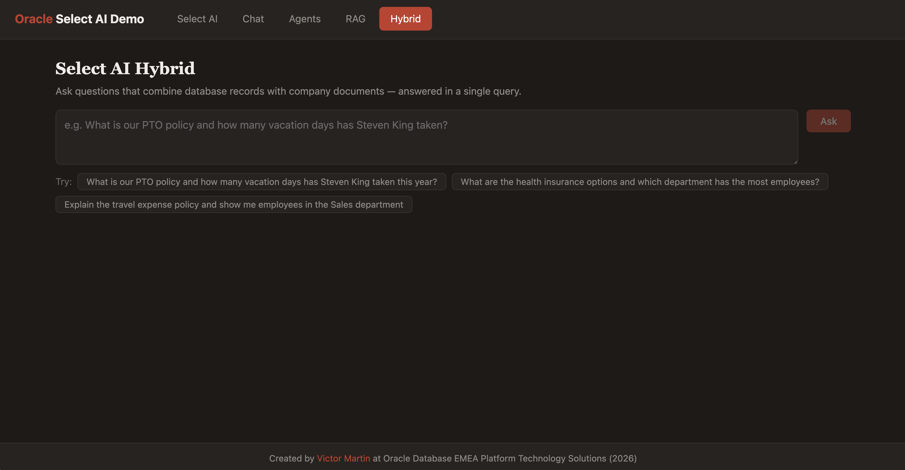
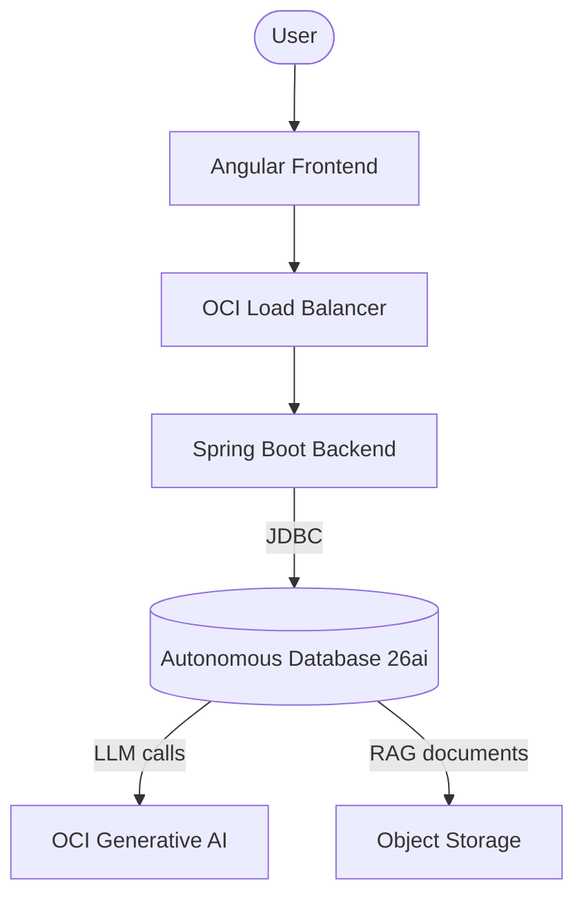

# Oracle Database 26ai Select AI Demo

A full-stack demo that puts Oracle Database 26ai's Select AI features in front of a web UI. Users type natural-language questions; the Autonomous Database translates them into SQL, orchestrates agentic workflows, or retrieves answers from documents — all powered by OCI Generative AI.



The backend is a thin Spring Boot layer that forwards prompts to the database via JDBC. The database does the heavy lifting: it generates SQL, calls the LLM, manages agent reasoning, and performs vector search over indexed documents. Infrastructure is provisioned with Terraform on OCI and configured with Ansible.

### Features

- **Select AI (NL2SQL)** — Natural language to SQL. Ask questions in plain English, get SQL queries and results from the HR sample schema.
- **Select AI Agents** — Agentic AI. The database autonomously reasons and executes multi-step analytical tasks.
- **Select AI RAG** — Retrieval Augmented Generation. Combines database knowledge with document retrieval for richer answers.

### Articles

- [Three Ways Oracle Database 26ai Answers Questions You Couldn't Ask Before](docs/articles/01-select-ai-three-ways-to-query.md) — What Select AI does: NL2SQL, RAG, and Agents explained with code and diagrams.
- [Deploying Oracle Database 26ai Select AI on OCI](docs/articles/02-select-ai-deploying-the-full-stack.md) — How the infrastructure gets provisioned: the Python CLI, Terraform, Ansible, and cloud-init pipeline.

## Architecture



## Prerequisites

| Tool      | Minimum version | Check                  |
| --------- | --------------- | ---------------------- |
| Python    | 3.11+           | `python3 --version`    |
| OCI CLI   | configured      | `~/.oci/config` exists |
| Terraform | 1.5+            | `terraform --version`  |
| Java      | 23+             | `java --version`       |
| Node.js   | 22+             | `node --version`       |
| npm       | 10+             | `npm --version`        |

## Deployment

### Step 1 — Install Python dependencies

```bash
pip install -r requirements.txt
```

### Step 2 — Interactive OCI setup

Reads your `~/.oci/config`, lists subscribed regions and compartments via the OCI SDK, and saves everything to `.env`. Also generates an Oracle-compliant database password.

```bash
python manage.py setup
```

### Step 3 — Build backend and frontend

Compiles the Spring Boot JAR and Angular production bundle. Checks tool versions before starting.

```bash
python manage.py build
```

### Step 4 — Generate Terraform variables

Renders `terraform.tfvars` from the `.env` values using a Jinja2 template.

```bash
python manage.py tf
```

### Step 5 — Deploy infrastructure

```bash
cd deploy/tf/app
```

```bash
terraform init
```

```bash
terraform plan -out=tfplan
```

```bash
terraform apply tfplan
```

This provisions the full OCI stack: VCN (3 subnets), Autonomous Database, 3 compute instances, load balancer, and Object Storage buckets with all artifacts.

### Step 6 — Verify provisioning

Go back to the project root and get the connection details:

```bash
cd ../../..
```

```bash
python manage.py ansible
```

This prints the load balancer IP, ops instance IP, and SSH command. SSH into the ops instance and wait for cloud-init to finish:

```bash
ssh -i ~/.ssh/your_key opc@<ops_ip>
```

```bash
sudo cloud-init status --wait
```

When cloud-init shows `status: done`, the demo is ready. Open the load balancer IP in your browser.

## Cleanup

Check for active resources and print destroy instructions:

```bash
python manage.py clean
```

If Terraform resources are still running, destroy them first:

```bash
cd deploy/tf/app
```

```bash
terraform destroy
```

Then re-run `python manage.py clean` to remove generated files (`.env`, `terraform.tfvars`, build artifacts).

## Troubleshooting

### Cloud-init logs

On any instance, check provisioning progress:

```bash
sudo cloud-init status
```

```bash
sudo tail -100 /var/log/cloud-init-output.log
```

### SSH to private instances

From the ops instance, reach backend and web VMs:

```bash
cat /home/opc/ansible_params.json | grep -E "backend_private_ip|web_private_ip"
```

```bash
ssh -i /home/opc/private.key opc@<backend_private_ip>
```

### Backend service

```bash
systemctl status backend
```

```bash
journalctl -u backend -f
```

### Web service

```bash
systemctl status nginx
```

### Re-run Ansible playbook (ops)

If provisioning failed partway through:

```bash
ansible-playbook -i ops.ini --extra-vars "@ansible_params.json" ansible_ops/server.yaml
```

## Project Structure

```
├── manage.py              # CLI: setup, build, tf, ansible, clean
├── requirements.txt       # Python dependencies
├── docs/
│   ├── articles/          # Technical articles
│   ├── todos/             # TODO tracking
│   └── issues/            # Known issues
├── src/
│   ├── backend/           # Spring Boot 3.5 + Java 23 + Gradle
│   └── frontend/          # Angular v21
└── deploy/
    ├── tf/                # Terraform (OCI infrastructure)
    │   ├── app/           # Main orchestration layer
    │   └── modules/       # adbs, backend, web, ops
    └── ansible/           # Ansible roles: ops, backend, web
```

## Local Development

### Backend

```bash
cd src/backend
```

```bash
./gradlew bootRun --args='--spring.profiles.active=local'
```

### Frontend

Proxies `/api` requests to `localhost:8080`.

```bash
cd src/frontend
```

```bash
npm install
```

```bash
npm start
```

Open http://localhost:4200.
