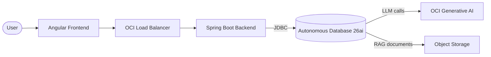
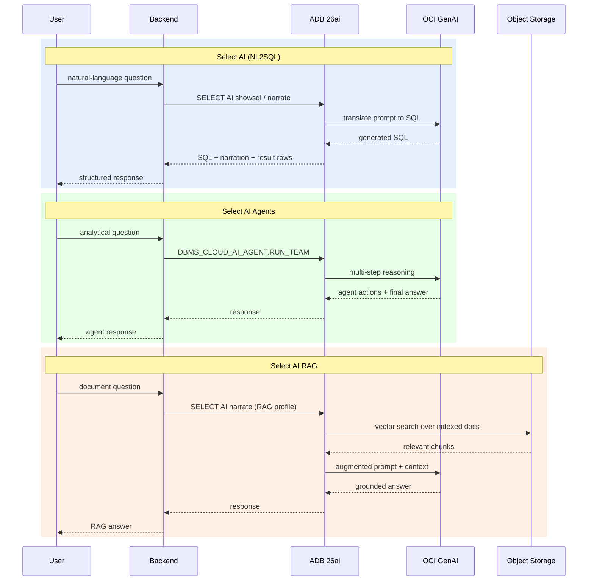

# Oracle Database 26ai Select AI Demo

A full-stack demo that puts Oracle Database 26ai's Select AI features in front of a web UI. Users type natural-language questions; the Autonomous Database translates them into SQL, orchestrates agentic workflows, or retrieves answers from documents — all powered by OCI Generative AI.

The backend is a thin Spring Boot layer that forwards prompts to the database via JDBC. The database does the heavy lifting: it generates SQL, calls the LLM, manages agent reasoning, and performs vector search over indexed documents. Infrastructure is provisioned with Terraform on OCI and configured with Ansible.

### Features

- **Select AI (NL2SQL)** — Natural language to SQL. Ask questions in plain English, get SQL queries and results from the HR sample schema.
- **Select AI Agents** — Agentic AI. The database autonomously reasons and executes multi-step analytical tasks.
- **Select AI RAG** — Retrieval Augmented Generation. Combines database knowledge with document retrieval for richer answers.

## Architecture



## Data Flow by Feature



## Prerequisites

- Python 3.11+
- OCI CLI configured (`~/.oci/config`)
- Terraform 1.5+
- Ansible 2.15+
- Java 23 (GraalVM or OpenJDK)
- Node.js 22+ / npm 11+

## Quick Start

1. Install Python dependencies

```bash
pip install -r requirements.txt
```

2. Interactive OCI setup (creates .env)

```bash
python manage.py setup
```

3. Generate Terraform variables

```bash
python manage.py tf
```

4. Deploy infrastructure

```bash
cd deploy/tf/app
terraform init
terraform plan -out=tfplan
terraform apply tfplan
```

5. After deployment, get Ansible commands

```bash
cd ../../..
python manage.py ansible
```

## Project Structure

```
├── manage.py              # CLI for setup, deployment, and management
├── requirements.txt       # Python dependencies
├── docs/                  # Documentation
│   ├── todos/             # TODO tracking
│   ├── articles/          # Technical articles
│   └── issues/            # Known issues
├── src/
│   ├── backend/           # Spring Boot 3.5 + Java 23
│   └── frontend/          # Angular v21
└── deploy/
    ├── tf/                # Terraform (OCI infrastructure)
    └── ansible/           # Ansible (configuration management)
```

## Local Development

Backend:

```bash
cd src/backend
./gradlew bootRun --args='--spring.profiles.active=local'
```

Frontend (proxies /api to localhost:8080):

```bash
cd src/frontend
npm install
npm start
```

Open http://localhost:4200 in your browser.
