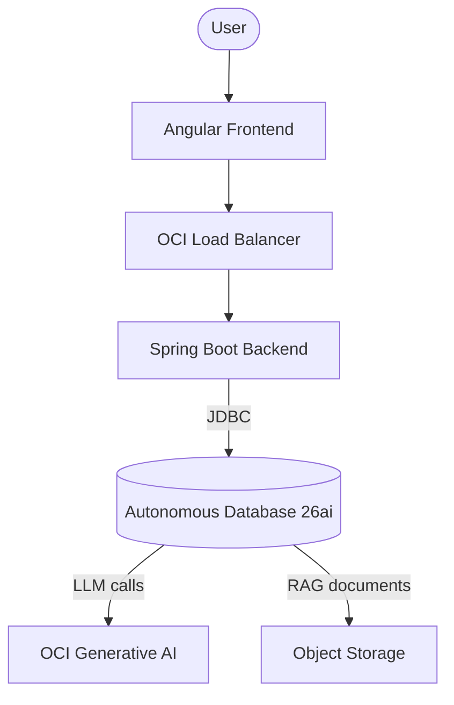
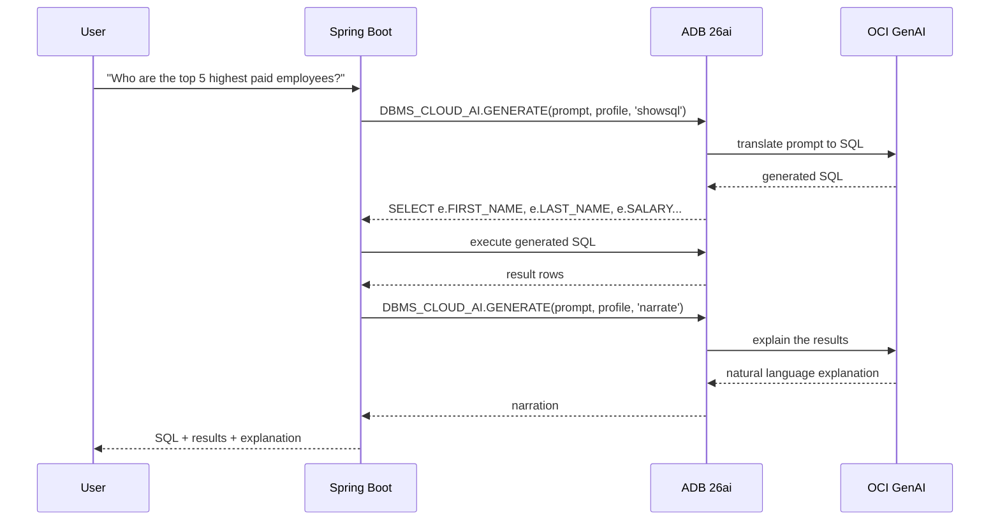
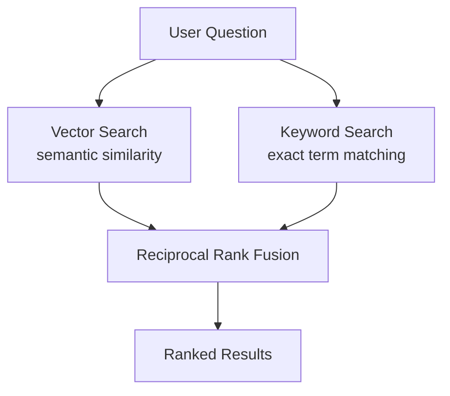
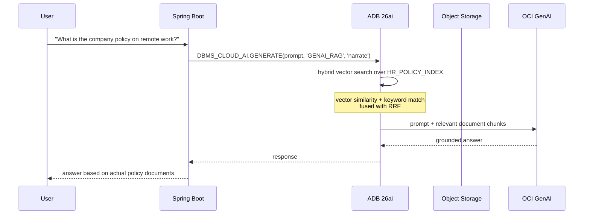
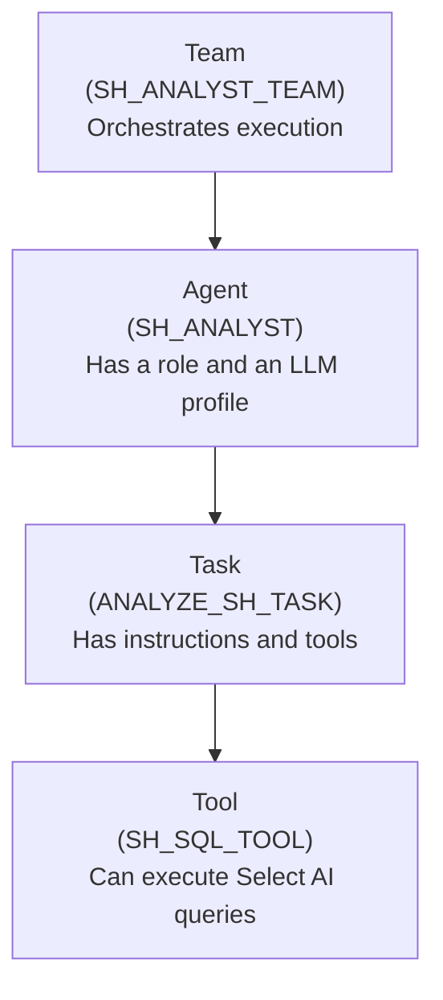
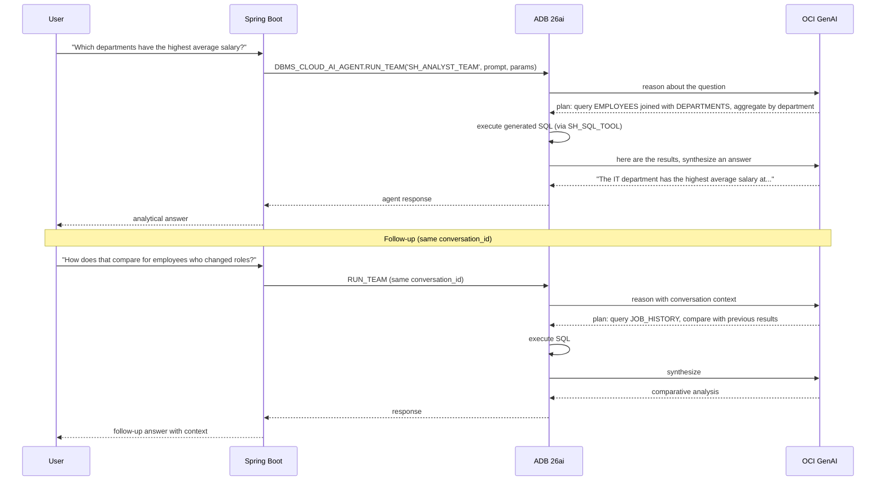
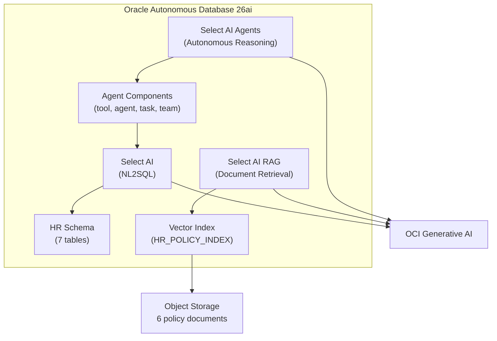

# Three Ways Oracle Database 26ai Answers Questions You Couldn't Ask Before

### Natural language queries, document retrieval, and autonomous agents — all inside the database

## Key Takeaways

- **Select AI turns plain English into SQL.** Ask "who are the top 5 highest paid employees?" and the database generates, executes, and explains the query — no SQL knowledge required.
- **RAG retrieves answers from documents, not just tables.** Upload policy documents to Object Storage, create a vector index, and the database answers questions like "what's our remote work policy?" by searching document chunks.
- **Hybrid vector search beats pure vector search.** Combining dense embeddings with keyword matching (fused via Reciprocal Rank Fusion) means the database finds documents by meaning _and_ by exact terms.
- **Agents reason autonomously.** Define a tool, an agent with a role, a task, and a team — the database breaks complex analytical questions into multi-step SQL workflows and executes them.
- **The backend is a JDBC passthrough.** The database does the heavy lifting. The Spring Boot backend is a thin layer that forwards prompts and returns results — about 150 lines of controller code.

## Frequently Asked Questions

**Why not just use an LLM directly?**
An LLM doesn't know your data. It can't tell you how many employees are in the IT department or what your company's PTO policy says. Select AI connects the LLM to your actual database schema and documents, so it generates real SQL against real tables and retrieves real document content — not hallucinated answers.

**Do I need a separate vector database for RAG?**
No. Oracle Database 26ai handles relational tables, vector indexes, and full-text search in a single instance. One connection pool, one set of credentials, one thing to monitor.

**What's the difference between RAG and Agents?**
RAG retrieves relevant text from documents to help the LLM answer a question. Agents go further — they can reason about a question, decide it needs multiple SQL queries, execute them in sequence, and synthesize the results. RAG is for document-based Q&A; Agents are for multi-step analytical workflows.

**What LLM does this use?**
OCI Generative AI. The demo uses Llama 3.3 70B Instruct by default, but you can swap models by changing the profile configuration. The database calls the LLM service directly via Resource Principal authentication — no API keys stored anywhere.

---

Every database holds answers. The problem is that getting those answers requires knowing SQL, understanding the schema, and sometimes knowing that the answer isn't even in a table — it's buried in a policy document or requires chaining multiple queries together.

Oracle Database 26ai's Select AI features tackle all three of these problems. You ask a question in plain English. The database figures out whether it needs to generate SQL, search through documents, or orchestrate a multi-step analysis — and does it.

This is a [POC I built](https://github.com/vmleon/oracle-database-select-ai) to demonstrate all three capabilities end-to-end: a web UI backed by Spring Boot, hitting an Autonomous Database on OCI that does everything through Select AI. The backend is deliberately thin — the interesting work happens inside the database.

## The Architecture



The stack:

- **Oracle Autonomous Database 26ai** — the center of everything. Generates SQL, calls the LLM, manages agent reasoning, performs vector search over indexed documents.
- **OCI Generative AI** — the LLM provider. The database calls it directly via Resource Principal authentication.
- **Spring Boot 3.5** + **Java 23** — a thin backend that forwards JDBC calls and returns JSON. About 150 lines of controller code.
- **Angular v21** — the frontend, with five pages for the five Select AI capabilities.
- **Terraform + Ansible** — infrastructure automation on OCI.

The key insight: the backend doesn't generate SQL, doesn't manage embeddings, doesn't orchestrate agents. It sends a prompt string to the database via JDBC and gets an answer back. The database does the heavy lifting.

## Select AI — Talking to Your Database in Plain English

### The Problem

You know the answer is in the database. "Who are the top 5 highest paid employees?" But getting it requires knowing that salaries are in the `EMPLOYEES` table, that you need to `ORDER BY SALARY DESC`, and that `FETCH FIRST 5 ROWS ONLY` is the Oracle syntax for limiting results. Multiply that by every question a non-technical stakeholder might ask, and you see the problem.

### How It Works

Select AI translates natural language into SQL. You configure a _profile_ that tells the database which LLM to use and which tables it can query. Then you ask questions in plain English.



Three actions drive everything:

- **`showsql`** — generates the SQL without executing it. You see exactly what the LLM produced.
- **`runsql`** — generates and executes the SQL, returns the result rows.
- **`narrate`** — generates a natural language explanation of the query results.

The demo app calls all three: it shows you the generated SQL, the results table, and a plain English narration. This transparency matters — you can verify that the generated SQL is correct before trusting the answer.

### The Profile

The profile is the configuration that tells Select AI which LLM provider to use and which database objects it can access. Here's the one this demo creates:

```sql

BEGIN
    DBMS_CLOUD_AI.create_profile(
        profile_name => '{{ profile_name }}',
        attributes   =>
        '{
            "provider": "oci",
            "credential_name": "OCI_API_KEY_CRED",
            "object_list": [
                {"owner": "HR", "name": "EMPLOYEES"},
                {"owner": "HR", "name": "DEPARTMENTS"},
                {"owner": "HR", "name": "JOBS"},
                {"owner": "HR", "name": "JOB_HISTORY"},
                {"owner": "HR", "name": "LOCATIONS"},
                {"owner": "HR", "name": "COUNTRIES"},
                {"owner": "HR", "name": "REGIONS"}
            ],
            "region": "{{ genai_region }}",
            "oci_compartment_id": "{{ oci_genai_compartment_id }}",
            "oci_apiformat": "GENERIC"
        }');
END;
/
```

The `object_list` is critical: it tells Select AI exactly which tables and schemas the LLM can reference when generating SQL. The LLM reads the table metadata — column names, data types, and importantly, _comments_ — to understand the schema.

### Table Comments: Teaching the LLM Your Schema

This is easy to overlook but it makes a real difference. The demo adds comments to every table and column in the HR schema:

```sql
COMMENT ON TABLE HR.EMPLOYEES IS
  'All current employees with their job, salary, manager, and department assignment';
COMMENT ON COLUMN HR.EMPLOYEES.SALARY IS
  'Monthly salary in USD';
COMMENT ON COLUMN HR.EMPLOYEES.COMMISSION_PCT IS
  'Commission percentage as a decimal (0.1 means 10%). NULL for non-sales roles';
COMMENT ON COLUMN HR.EMPLOYEES.MANAGER_ID IS
  'Employee ID of the direct manager. NULL for the CEO (top of org chart). Self-join to EMPLOYEES table';
```

Without comments, the LLM guesses what `COMMISSION_PCT` means from the column name alone. With comments, it knows it's a decimal percentage and that NULL means non-sales. This is how you get accurate SQL generation without hand-holding the LLM on every query. The full set of comments covers all 7 tables — see [`add_comments.sql`](https://github.com/vmleon/oracle-database-select-ai/blob/main/deploy/ansible/ops/base/files/init/add_comments.sql).

### The Backend Call

The Spring Boot backend makes a single JDBC call for each action:

```java
private static final String GENERATE_SQL =
    "SELECT DBMS_CLOUD_AI.GENERATE(prompt => ?, profile_name => ?, action => ?) FROM DUAL";

@PostMapping("/query")
public QueryResponse query(@RequestBody QueryRequest request) {
    String prompt = validatePrompt(request.prompt());

    String sqlCode = jdbcTemplate.queryForObject(
            GENERATE_SQL, String.class, prompt, queryProfile, "showsql");

    String narration = jdbcTemplate.queryForObject(
            GENERATE_SQL, String.class, prompt, queryProfile, "narrate");

    List<Map<String, Object>> rows = jdbcTemplate.queryForList(
            "SELECT * FROM (" + sqlCode + ") WHERE ROWNUM <= 500");

    return new QueryResponse(prompt, sqlCode, narration, rows);
}
```

That's it. One SQL template, three calls with different actions. The database handles everything else — LLM inference, SQL generation, result formatting. The full controller is about 150 lines including validation and timing — see [`SelectAIController.java`](https://github.com/vmleon/oracle-database-select-ai/blob/main/src/backend/src/main/java/dev/victormartin/selectai/demo/controller/SelectAIController.java).

## Select AI RAG — When the Answer Isn't in a Table

### The Problem

"What's our remote work policy?" That answer isn't in any database table. It's in a policy document — a PDF or a text file sitting in a shared drive somewhere. Traditional database queries can't help. And if you just ask the LLM directly, it'll hallucinate something plausible but entirely made up.

RAG (Retrieval Augmented Generation) solves this by first _finding_ the relevant document chunks, then feeding them to the LLM as context so it can generate a grounded answer.

### The Documents

The demo simulates a real corporate knowledge base with six HR policy documents uploaded to OCI Object Storage:

| Document                     | What It Covers                                                                                                |
| ---------------------------- | ------------------------------------------------------------------------------------------------------------- |
| **PTO Policy**               | Vacation tiers (15-30 days based on tenure), sick leave, personal days, holidays, bereavement, parental leave |
| **Benefits Guide**           | Health insurance (PPO/HMO), HSA/FSA, dental, vision, life insurance, 401(k), wellness programs                |
| **Travel & Expense Policy**  | Flight/hotel guidelines, per diem rates by city tier, expense reporting                                       |
| **Employee Handbook**        | Code of conduct, anti-harassment, remote work, dress code, confidentiality                                    |
| **Onboarding Checklist**     | New hire procedures, first-week tasks, systems access                                                         |
| **Performance Review Guide** | Review cycles, rating criteria, goal setting, feedback processes                                              |

These are realistic, detailed documents — the PTO policy alone covers vacation tiers, carryover rules, blackout periods, and several types of leave. They are stored in OCI Object Storage and indexed by the database.

See the full documents in [`deploy/ansible/ops/base/files/rag-docs/`](https://github.com/vmleon/oracle-database-select-ai/tree/main/deploy/ansible/ops/base/files/rag-docs).

### The Vector Index

The database needs to convert those documents into searchable vectors. A _vector index_ handles this:

```sql
BEGIN
    DBMS_CLOUD_AI.CREATE_VECTOR_INDEX(
        index_name  => 'HR_POLICY_INDEX',
        attributes  => '{"vector_db_provider": "oracle",
                         "location":           "https://objectstorage.{{ region_name }}.oraclecloud.com/n/{{ rag_bucket_namespace }}/b/{{ rag_bucket_name }}/o/",
                         "object_storage_credential_name": "OCI_API_KEY_CRED",
                         "profile_name":       "GENAI_RAG",
                         "chunk_size":         1500,
                         "chunk_overlap":      300}'
    );
END;
/
```

What happens when you create this index:

1. The database reads every document from the Object Storage bucket.
2. It splits each document into chunks of 1500 characters with 300-character overlap (so context isn't lost at chunk boundaries).
3. It generates vector embeddings for each chunk using the LLM provider.
4. It stores both the text chunks and their embeddings in the database.

From this point on, when you ask a question, the database performs vector similarity search over those chunks, finds the most relevant ones, and feeds them to the LLM as context for generating the answer.

### The RAG Profile

The RAG profile looks different from the query profile. Instead of an `object_list` pointing to tables, it has a `vector_index_name` pointing to the document index:

```sql
BEGIN
    DBMS_CLOUD_AI.create_profile(
        profile_name => 'GENAI_RAG',
        attributes   =>
        '{
            "provider": "oci",
            "credential_name": "OCI_API_KEY_CRED",
            "vector_index_name": "HR_POLICY_INDEX",
            "region": "{{ genai_region }}",
            "oci_compartment_id": "{{ oci_genai_compartment_id }}",
            "oci_apiformat": "GENERIC"
        }');
END;
/
```

No tables. Just the vector index. When you call `DBMS_CLOUD_AI.GENERATE` with this profile and the `narrate` action, the database searches the indexed documents instead of generating SQL.

### Why Hybrid Vector Search Matters

Pure vector search works by converting text into dense numerical vectors (embeddings) that map meaning into geometric space. Semantically similar text ends up near each other — a query about "time off" will match chunks about "vacation days" and "paid leave" even though the exact words differ.

But pure vector search has a blind spot: exact terms. If someone asks about "Section 4.2 of the PTO policy" or mentions a specific benefit plan number, the embedding model encodes _meaning_, not keywords. The exact term gets diluted in the vector representation.

Hybrid vector search solves this by running both searches in parallel:



**Reciprocal Rank Fusion (RRF)** merges the two result lists by rank position rather than trying to normalize incompatible scores (cosine similarity is bounded 0-1, BM25 keyword scores are unbounded). A document that's #1 in vector results and #3 in keyword results gets a combined rank that reflects both signals.

The result: the database finds relevant documents whether the match is semantic ("How much vacation do I get?"), lexical ("Section 4.2"), or both.

### The RAG Flow



The backend call is identical in shape to the NL2SQL call — same `DBMS_CLOUD_AI.GENERATE`, just a different profile:

```java
@PostMapping("/rag")
public RagResponse rag(@RequestBody RagRequest request) {
    String prompt = validatePrompt(request.prompt());

    String answer = jdbcTemplate.queryForObject(
            GENERATE_SQL, String.class, prompt, ragProfile, "narrate");

    return new RagResponse(prompt, answer);
}
```

Same one-liner. Different profile, different behavior. The database decides whether to generate SQL or search documents based on the profile configuration.

## Select AI Agents — When One Query Isn't Enough

### The Problem

"Which departments have the highest average salary, and how has that changed for employees who switched roles?" That's not a single SQL query. It requires querying the `EMPLOYEES` table for current salaries, the `JOB_HISTORY` table for role changes, joining them, aggregating, and comparing. A human analyst would break this into steps. An agent does the same thing.

### How Agents Work

Select AI Agents go beyond translating a question into SQL. They _reason_ about what's needed, decide which queries to run, execute them, and synthesize the results. The database provides a four-layer abstraction to define this:



**Tool** — what the agent can _do_. In this case, execute Select AI queries against the database:

```sql
BEGIN
    DBMS_CLOUD_AI_AGENT.CREATE_TOOL(
        tool_name  => 'SH_SQL_TOOL',
        attributes => '{"tool_type": "SQL",
                        "tool_params": {"profile_name": "{{ profile_name }}"}}'
    );
END;
/
```

The tool points to the same Select AI profile used for NL2SQL. The agent can generate and execute SQL — the same capability as the query endpoint, but orchestrated by the agent's reasoning.

**Agent** — _who_ is doing the work. It has a role description that tells the LLM how to behave:

```sql
BEGIN
    DBMS_CLOUD_AI_AGENT.CREATE_AGENT(
        agent_name => 'SH_ANALYST',
        attributes => '{"profile_name": "{{ profile_name }}",
                        "role": "You are a data analyst who answers questions about
                                 sales history data. The database contains customers,
                                 countries, demographics, profits, promotions, and
                                 products tables in the SH schema."}'
    );
END;
/
```

The role description is essentially a system prompt. It tells the LLM what persona to adopt and what data is available. The more specific the role, the better the agent's reasoning.

**Task** — _what_ the agent should do, and with which tools:

```sql
BEGIN
    DBMS_CLOUD_AI_AGENT.CREATE_TASK(
        task_name  => 'ANALYZE_SH_TASK',
        attributes => '{"instruction": "Answer the user question about sales data:
                                        {query}. Use the SQL tool to query the database.",
                        "tools": ["SH_SQL_TOOL"],
                        "enable_human_tool": "false"}'
    );
END;
/
```

The `{query}` placeholder gets replaced with the user's actual question at runtime. `enable_human_tool` is set to false — the agent doesn't pause to ask the user for clarification; it reasons autonomously.

**Team** — the orchestration layer that binds agents to tasks and defines execution order:

```sql
BEGIN
    DBMS_CLOUD_AI_AGENT.CREATE_TEAM(
        team_name  => 'SH_ANALYST_TEAM',
        attributes => '{"agents": [{"name": "SH_ANALYST", "task": "ANALYZE_SH_TASK"}],
                        "process": "sequential"}'
    );
END;
/
```

This demo uses a single agent with a single task in sequential mode. But the team abstraction supports multiple agents with different roles and tools — imagine a "data analyst" agent working with a "policy expert" agent, each with their own tools and tasks.

See the full agent setup in [`create_agent.sql.j2`](https://github.com/vmleon/oracle-database-select-ai/blob/main/deploy/ansible/ops/base/files/init/create_agent.sql.j2).

### Multi-Turn Conversations

Agents support conversation context. The backend passes a `conversation_id` so the agent remembers what was discussed:

```java
@PostMapping("/agents")
public AgentResponse agents(@RequestBody AgentRequest request) {
    String prompt = validatePrompt(request.prompt());
    String conversationId = request.conversationId() != null
            ? request.conversationId()
            : UUID.randomUUID().toString();

    String paramsJson = String.format(
            "{\"conversation_id\": \"%s\"}", conversationId);

    String response = jdbcTemplate.queryForObject(
            "SELECT DBMS_CLOUD_AI_AGENT.RUN_TEAM(?, ?, ?) FROM DUAL",
            String.class,
            agentsTeam, prompt, paramsJson);

    return new AgentResponse(prompt, response, conversationId);
}
```

First question: "Which departments have the highest average salary?" Follow-up: "How does that compare for employees who changed roles?" The agent uses the same `conversation_id` to maintain context — it knows "that" refers to the department salary analysis from the previous turn.

### The Agent Flow



The frontend presents this as a chat interface — user messages on the right, agent responses on the left, with a "New Conversation" button to reset context. See the full component in [`agents.component.ts`](https://github.com/vmleon/oracle-database-select-ai/blob/main/src/frontend/src/app/agents/agents.component.ts).

## One Database, Three Capabilities



No separate vector database. No external agent framework. No embedding service. One Autonomous Database handles:

- **SQL generation** from natural language (Select AI profiles with `object_list`)
- **Document retrieval** with hybrid vector search (vector indexes over Object Storage)
- **Autonomous reasoning** with multi-step query execution (agent teams with SQL tools)

The backend is 150 lines of JDBC calls. The database does the rest.

The full architecture — Terraform infrastructure, Ansible automation, Spring Boot backend, Angular frontend — is covered in [Deploying Oracle Database 26ai Select AI on OCI](02-select-ai-deploying-the-full-stack.md). If you want to reproduce this end-to-end, start there.

---

**Stack:** Spring Boot 3.5.3 | Java 23 | Angular 21 | Oracle Autonomous Database 26ai | OCI Generative AI | Terraform + Ansible

**Code:** [github.com/vmleon/oracle-database-select-ai](https://github.com/vmleon/oracle-database-select-ai)
