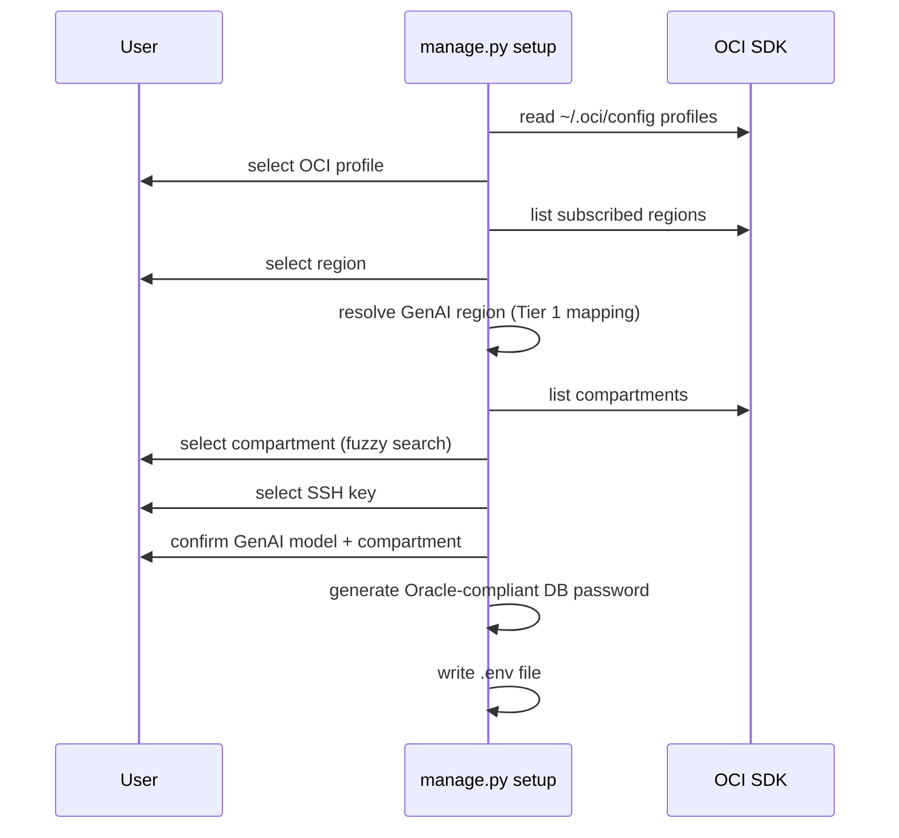
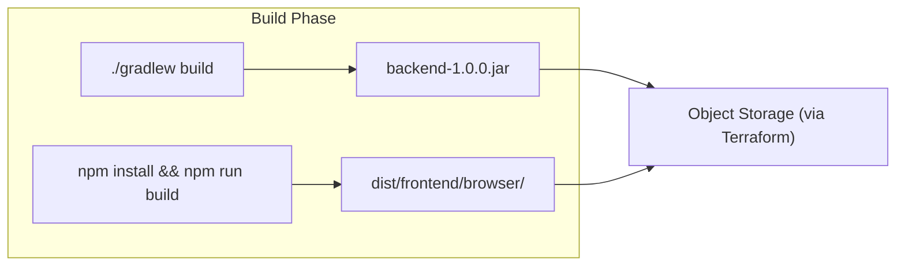
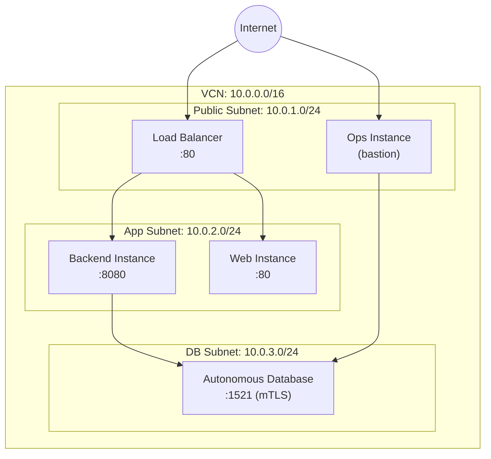
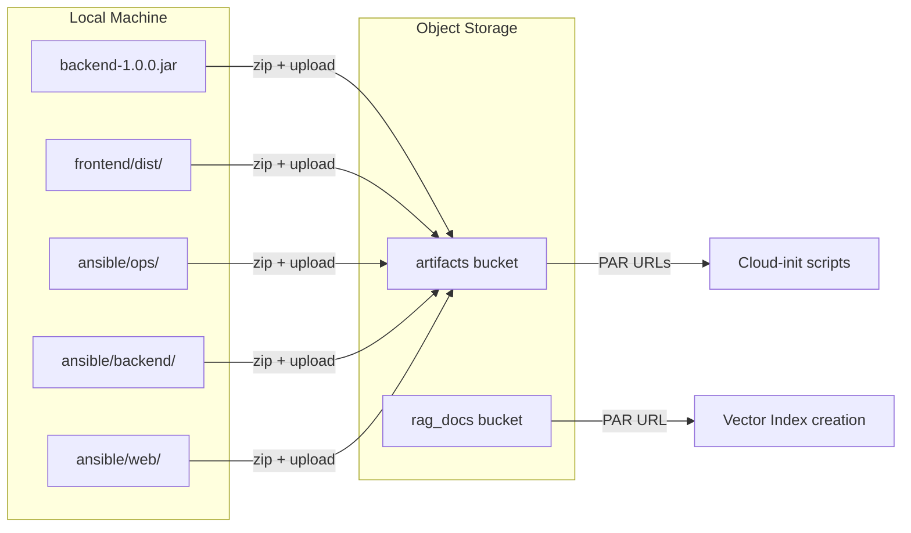
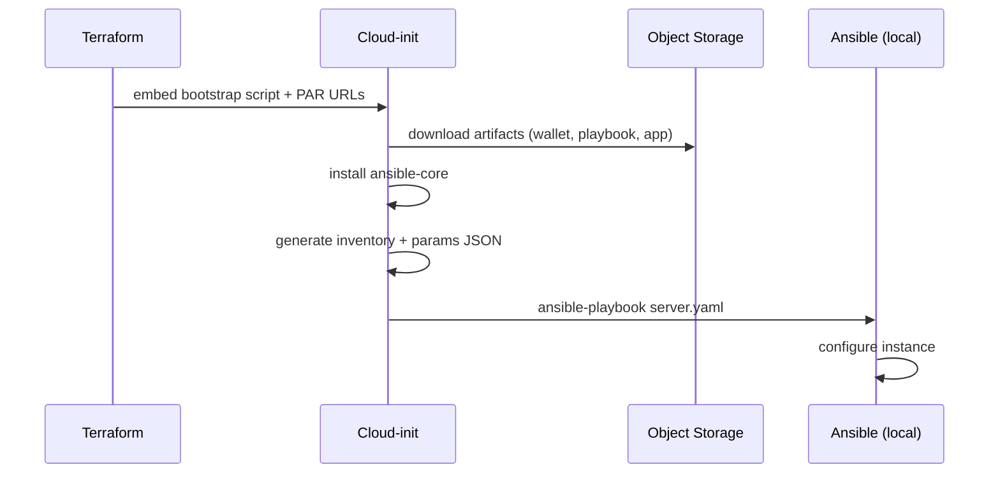
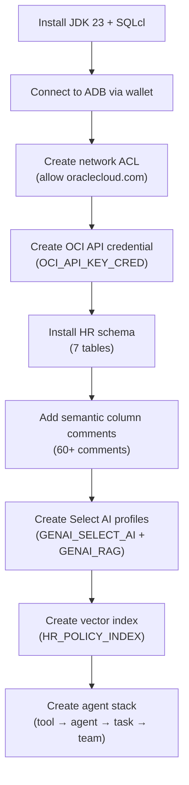
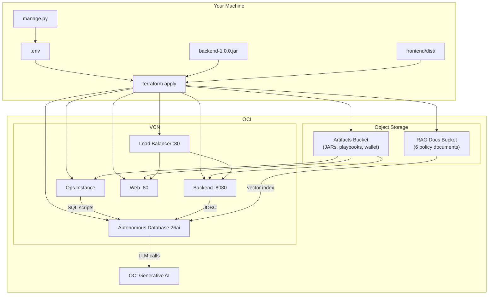

# Deploying Oracle Database 26ai Select AI on OCI — From Setup to Running Demo

### A Python CLI, Terraform, Ansible, and cloud-init turn four commands into a fully provisioned AI demo

## Key Takeaways

- **A Python CLI orchestrates the entire deployment.** `manage.py` guides you through four phases — `setup`, `build`, `tf`, `ansible` — each one feeding the next. No manual copy-pasting of OCIDs or remembering terraform variable names.
- **Terraform provisions everything in one apply.** VCN with three subnets, an Autonomous Database, three compute instances, a load balancer, two object storage buckets, and pre-authenticated request URLs — all from a single `terraform apply`.
- **Cloud-init eliminates the "SSH in and configure" step.** Each instance boots with a script that downloads its artifacts from Object Storage and runs its own Ansible playbook. By the time you SSH in, the instance is already configured.
- **The ops instance is the orchestrator.** It connects to the database, installs the HR schema, adds semantic column comments, creates Select AI profiles, builds the vector index for RAG, and assembles the agent stack — all through SQL scripts executed by Ansible.
- **Cleanup is safe by default.** `manage.py clean` checks Terraform state for active resources before deleting anything. It won't remove your `.env` or build artifacts while infrastructure is still running.

## Frequently Asked Questions

**Why a Python CLI instead of a Makefile or shell scripts?**
The setup phase needs interactive prompts — selecting OCI profiles, regions, compartments — and the tf phase needs Jinja2 templating for `terraform.tfvars`. Python with Click, InquirerPy, and Jinja2 handles both cleanly. A Makefile can't do interactive fuzzy-search dropdowns.

**Why does cloud-init run Ansible instead of running Ansible from my laptop?**
Because the backend and web instances are in private subnets with no public IPs. You can't reach them directly. Cloud-init runs on the instance itself, so it doesn't need external connectivity. The ops instance is the only one with a public IP, and even that runs its own Ansible locally.

**Can I deploy this in any OCI region?**
You can deploy the infrastructure in any region, but OCI Generative AI has full on-demand model support only in five Tier 1 regions (Chicago, Frankfurt, London, Osaka, São Paulo). The CLI automatically maps your infrastructure region to the nearest GenAI region — your database lives in us-ashburn-1 but calls the LLM in us-chicago-1.

**How long does the full deployment take?**
About 15-20 minutes. Terraform takes 5-8 minutes (the Autonomous Database is the slowest resource). Cloud-init on the ops instance takes another 5-10 minutes — it's installing the HR schema, creating vector indexes, and building the agent stack. The backend and web instances are faster since they just deploy a JAR and a static bundle.

---

Deploying a demo that combines NL2SQL, RAG, and AI Agents requires more than just running the application. You need a database with the right schema and semantic comments, an LLM provider with credentials and profiles, documents indexed for vector search, an agent stack wired together, and a backend and frontend deployed behind a load balancer.

That's a lot of moving parts. This article walks through how a Python CLI, Terraform, Ansible, and cloud-init work together to provision all of it on OCI — from an empty compartment to a running demo in four commands.

This is the companion article to [Three Ways Oracle Database 26ai Answers Questions You Couldn't Ask Before](01-select-ai-three-ways-to-query.md), which covers what Select AI does — NL2SQL, RAG, and Agents in detail with code snippets, sequence diagrams, and the backend calls. Read that first for the full picture of the three capabilities. This article covers how the whole thing gets deployed.

## The Pipeline

The deployment is a four-phase pipeline. Each phase produces something the next phase needs.


| Phase         | Command                    | What it does                           | What it produces                                |
| ------------- | -------------------------- | -------------------------------------- | ----------------------------------------------- |
| **Setup**     | `python manage.py setup`   | Interactive OCI configuration          | `.env` file with all credentials and settings   |
| **Build**     | `python manage.py build`   | Compiles backend JAR and frontend dist | `backend-1.0.0.jar` + Angular production bundle |
| **Terraform** | `python manage.py tf`      | Renders `terraform.tfvars` from `.env` | Ready-to-apply Terraform configuration          |
| **Ansible**   | `python manage.py ansible` | Prints SSH and provisioning commands   | Connection info for the ops instance            |

The CLI doesn't run Terraform or Ansible directly — it prepares everything so you can run them yourself with full visibility. You see the plan before you apply it.

## Phase 1: Setup — Interactive OCI Configuration

### The Problem

Deploying on OCI requires a dozen identifiers: tenancy OCID, user OCID, compartment OCID, region, fingerprint, API key path, SSH keys, GenAI model name, GenAI compartment, GenAI region. Getting any one of these wrong means a failed deployment 20 minutes later. Copy-pasting OCIDs from the OCI Console is error-prone.

### How It Works

`python manage.py setup` reads your `~/.oci/config`, calls the OCI SDK to list your subscribed regions and compartments, and presents interactive prompts with fuzzy search. You pick from real values instead of pasting identifiers.



The GenAI region resolution is worth highlighting. OCI Generative AI has full on-demand model support in five regions. If you deploy in `us-ashburn-1`, the CLI maps it to `us-chicago-1` automatically:

```python
GENAI_REGION_MAP = {
    "us-ashburn-1": "us-chicago-1",
    "us-phoenix-1": "us-chicago-1",
    "eu-amsterdam-1": "eu-frankfurt-1",
    "ap-tokyo-1": "ap-osaka-1",
    # ... 25+ mappings
}
```

You can override this if needed. The result is a `.env` file with 16 variables — everything Terraform needs to provision the full stack.

The CLI also generates an Oracle-compliant database password (starts with a letter, at least 2 special characters, at least 2 digits) so you don't have to remember Oracle's password rules.

## Phase 2: Build — Backend JAR and Frontend Dist

### The Problem

Terraform needs to upload the backend JAR and frontend dist to Object Storage before creating the compute instances. Cloud-init on each instance downloads these artifacts during boot. If the artifacts don't exist, the instances boot into an unconfigured state.

### How It Works

`python manage.py build` checks that Java 23, Node 22, and npm are installed, then builds both artifacts:



The backend produces a single Spring Boot fat JAR. The frontend produces an Angular production bundle with ahead-of-time compilation. Both get zipped and uploaded to Object Storage by Terraform in the next phase.

The build command also validates tool versions before starting — a `Java 21` installation won't silently produce a broken JAR, it'll fail immediately with a clear message.

## Phase 3: Terraform — The Full OCI Stack

### The Problem

The demo needs a VCN with proper subnetting, an Autonomous Database, three compute instances in the right subnets, a load balancer with routing rules, two Object Storage buckets, and pre-authenticated request URLs for artifact downloads. Creating these manually in the OCI Console would take hours and be impossible to reproduce.

### How It Works

`python manage.py tf` renders a Jinja2 template into `terraform.tfvars` using the values from `.env`:

```python
template = Template(template_file.read_text())
tfvars_content = template.render(
    profile=os.getenv("OCI_PROFILE"),
    tenancy_ocid=os.getenv("OCI_TENANCY_OCID"),
    region=os.getenv("OCI_REGION"),
    genai_region=os.getenv("OCI_GENAI_REGION"),
    compartment_ocid=os.getenv("OCI_COMPARTMENT_OCID"),
    db_admin_password=os.getenv("DB_ADMIN_PASSWORD"),
    ssh_public_key=os.getenv("SSH_PUBLIC_KEY"),
    # ... 16 variables total
)
```

Then you run Terraform yourself:

```bash
cd deploy/tf/app
terraform init
terraform plan -out=tfplan
terraform apply tfplan
```

### The Network

Terraform creates a VCN with three subnets, each serving a different layer:



The load balancer routes requests based on path:

- `/api/*` → backend instance on port 8080
- Everything else → web instance on port 80

Backend and web instances have no public IPs. They're only reachable through the load balancer or via SSH tunneling through the ops instance.

### The Modules

Terraform is organized into four modules:

```
deploy/tf/
├── app/              # Orchestration: VCN, subnets, LB, storage
│   ├── network.tf    # VCN, 3 subnets, security lists, gateways
│   ├── lb.tf         # Load balancer, routing policies
│   └── storage.tf    # Object Storage buckets, artifact uploads, PARs
└── modules/
    ├── adbs/         # Autonomous Database (eCPU, OLTP, mTLS)
    ├── backend/      # Backend compute + cloud-init
    ├── web/          # Web compute + cloud-init
    └── ops/          # Ops/bastion compute + cloud-init
```

**adbs** — provisions an Autonomous Database with 2 eCPUs and 1 TB storage. Generates a wallet ZIP that gets uploaded to Object Storage for the backend and ops instances to download.

**backend** — creates an Oracle Linux 9 VM (1 OCPU, 16 GB RAM) in the app subnet. Its cloud-init script downloads the JAR, wallet, and Ansible playbook from Object Storage via pre-authenticated request URLs.

**web** — same shape VM in the app subnet. Cloud-init downloads the Angular dist and Ansible playbook.

**ops** — the only instance with a public IP. Cloud-init downloads the wallet, Ansible playbook, and all the SQL initialization scripts.

### Artifact Storage

Terraform handles artifact delivery through Object Storage with PARs (Pre-Authenticated Requests):



Each artifact gets its own pre-authenticated request URL with a configurable expiration. Cloud-init scripts on each instance use these URLs to download exactly the artifacts they need — no OCI CLI or SDK required on the instance during boot.

A second bucket holds the RAG policy documents (PTO policy, benefits guide, employee handbook, etc.). The ops instance points the vector index at this bucket so the database can read and chunk the documents.

## Phase 4: Cloud-init and Ansible — Automated Provisioning

### The Problem

Three instances need different software stacks: the ops instance needs SQLcl and JDK to run database scripts, the backend needs JDK and the Spring Boot JAR as a systemd service, and the web instance needs Nginx with the Angular bundle. Setting this up manually via SSH would mean three separate sessions with different steps.

### How It Works

Each instance boots with a cloud-init script embedded by Terraform. The script downloads artifacts from Object Storage, installs Ansible, generates an inventory and parameters file, and runs the appropriate playbook — all before anyone SSH's in.



`python manage.py ansible` reads the ops instance IP from Terraform output and prints the SSH command and troubleshooting steps:

```
Load Balancer: 130.x.x.x
Ops instance:  140.x.x.x

1. SSH to ops instance:
   ssh -i ~/.ssh/id_rsa opc@140.x.x.x

2. Wait for cloud-init to finish:
   sudo cloud-init status --wait

3. Re-run ops playbook (if needed):
   ansible-playbook -i ops.ini --extra-vars "@ansible_params.json" ansible_ops/server.yaml
```

### The Ops Instance — Database Orchestrator

The ops instance does the most work. Its Ansible playbook runs 27 tasks that configure the database from scratch:



The semantic column comments in step 6 are critical for Select AI accuracy:

```sql
COMMENT ON TABLE HR.EMPLOYEES IS
  'All current employees with their job, salary, manager, and department assignment';
COMMENT ON COLUMN HR.EMPLOYEES.COMMISSION_PCT IS
  'Commission percentage as a decimal (0.1 means 10%). NULL for non-sales roles';
```

Without these comments, the LLM guesses column semantics from names alone. With them, it knows `COMMISSION_PCT` is a decimal percentage and that NULL means non-sales — the difference between accurate and wrong SQL.

The vector index in step 8 points at the RAG documents bucket and chunks every document (1500 characters, 300 overlap) into searchable embeddings.

The agent stack in step 9 assembles four components:

```sql
-- Tool: what the agent can do
DBMS_CLOUD_AI_AGENT.CREATE_TOOL('SH_SQL_TOOL', ...)

-- Agent: who does the work (with a role/persona)
DBMS_CLOUD_AI_AGENT.CREATE_AGENT('SH_ANALYST', ...)

-- Task: what to do, with which tools
DBMS_CLOUD_AI_AGENT.CREATE_TASK('ANALYZE_SH_TASK', ...)

-- Team: orchestration layer
DBMS_CLOUD_AI_AGENT.CREATE_TEAM('SH_ANALYST_TEAM', ...)
```

By the time the ops playbook finishes, the database has everything: schema, comments, credentials, profiles, vector index, and agents.

### The Backend Instance

The backend Ansible playbook deploys Spring Boot as a systemd service:

1. Install JDK 23
2. Copy `backend-1.0.0.jar` to `/home/opc/backend/`
3. Render `application.yaml` with database connection (wallet path, TNS alias) and profile names (`GENAI_SELECT_AI`, `GENAI_RAG`, `SH_ANALYST_TEAM`)
4. Create `backend.service` systemd unit
5. Start and enable the service

The rendered `application.yaml` wires the backend to everything the ops instance created:

```yaml
spring:
  datasource:
    url: jdbc:oracle:thin:@selectai_high?TNS_ADMIN=/home/opc/backend/wallet
    username: ADMIN
selectai:
  profile:
    query: GENAI_SELECT_AI
    rag: GENAI_RAG
  agents:
    team: SH_ANALYST_TEAM
```

The backend listens on port 8080 with no public IP — only the load balancer can reach it.

### The Web Instance

The simplest of the three:

1. Install Nginx
2. Extract Angular dist to `/usr/share/nginx/html/frontend/browser/`
3. Configure Nginx with SPA routing (`try_files $uri $uri/ /index.html`)
4. Start and enable Nginx

The `try_files` directive is important — Angular handles routing client-side, so any path that doesn't match a static file needs to fall back to `index.html`. Without this, refreshing the page on `/agents` would return a 404.

## The Full Picture



Four commands, 15-20 minutes:

1. **`python manage.py setup`** — interactive configuration → `.env`
2. **`python manage.py build`** — compile backend and frontend → JAR + dist
3. **`python manage.py tf`** → `terraform apply` — provision OCI infrastructure
4. **`python manage.py ansible`** — verify cloud-init completed successfully

When it's done, you have a load balancer IP serving an Angular app that talks to a Spring Boot backend that forwards JDBC calls to an Autonomous Database running Select AI, RAG, and Agents — all provisioned automatically.

## Cleanup

`python manage.py clean` handles teardown safely:

1. Checks `terraform.tfstate` for active resources
2. If resources exist, prints `terraform destroy` instructions and stops
3. If no resources (or already destroyed), deletes generated files: `.env`, `terraform.tfvars`, state files, build artifacts, `node_modules`

It won't delete your infrastructure configuration while instances are still running.

---

**Stack:** Python 3 (Click, InquirerPy, Jinja2, Rich) | Terraform (OCI provider ~6.35) | Ansible | Oracle Linux 9 | Spring Boot 3.5.3 | Java 23 | Angular 21 | Oracle Autonomous Database 26ai | OCI Generative AI

**Code:** [github.com/vmleon/oracle-database-select-ai](https://github.com/vmleon/oracle-database-select-ai)
